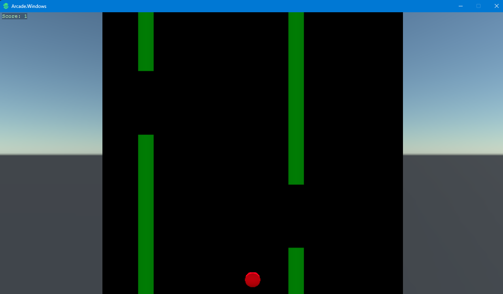
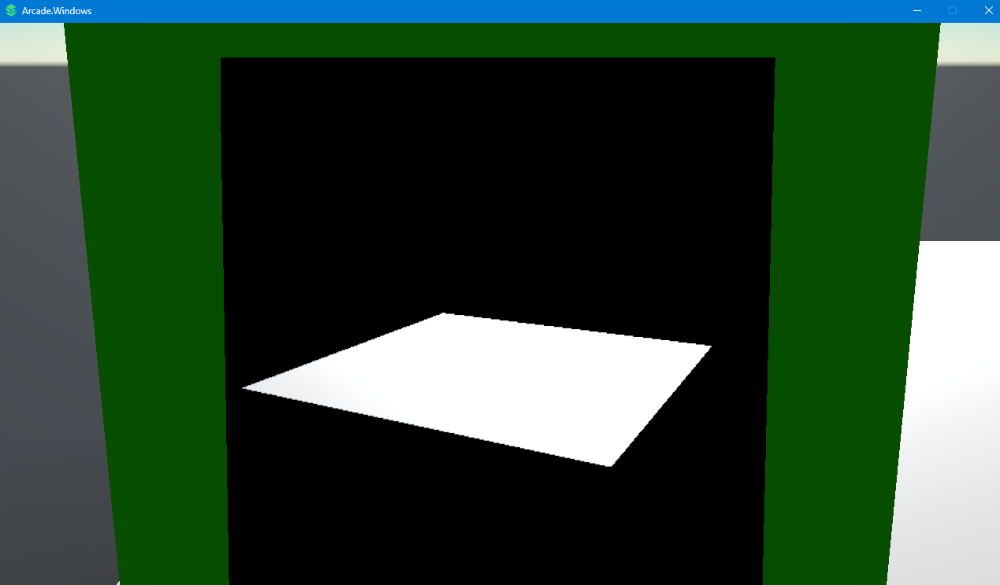

# Stride.Arcade.Sample
Unfinished example of using Render Textures to handle Arcade cabinet screens

## FlappyBall Arcade game
Controls:
- [Space] jump
- [Escape] Leave

## Fly Cam Arcade Demo
Controls:
- [WASD] movement
- [Right click drag] Rotate camera

